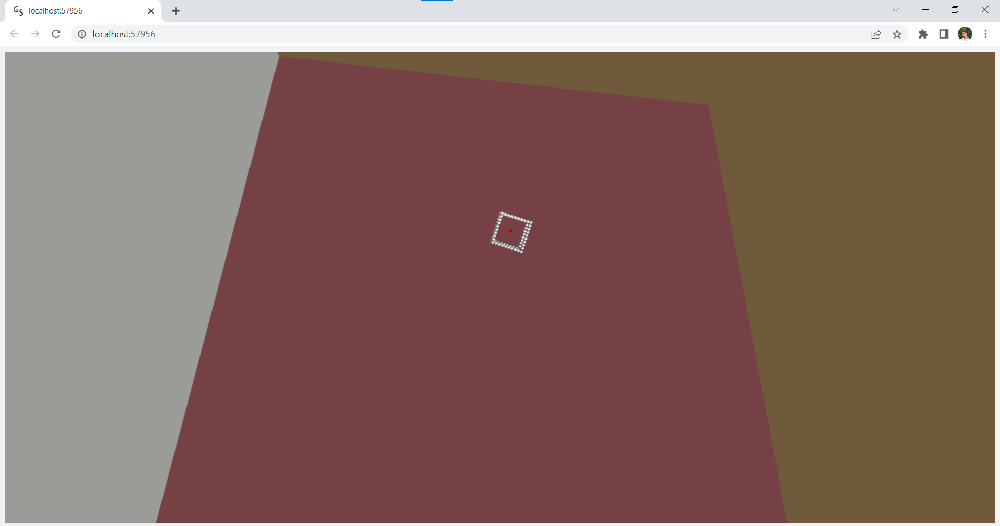

### Cube In Space
This is a simulation of rigid body falling in vacuum. Made as a coursework for a Numerical Modeling of Dynamic Systems class. Based on David Baraff notes (https://graphics.pixar.com/pbm2001/pdf/notesg.pdf).

#### Run
To run this project, download all necessary libraries and execute `simulator.py` script. Simulation will open in your browser.

#### Screenshot
